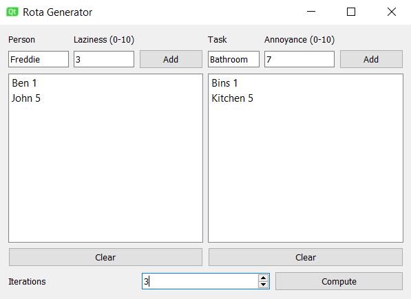

# Who2Clean

This project is for creating a task rota (perhaps between housemates...). It makes use of [Qt](https://www.qt.io/) to generate an interactive GUI. 
The user can enter a set of individuals (and their laziness), as well as a set of tasks.

A rota is computed for a chosen number of iterations and saved to csv.

## Files
- [Who2Clean](Who2Clean/who2clean.cpp): GUI implementation and event handling.
- [RotaComputer](Who2Clean/rotacomputer.cpp): Background computation for generating rota and saving to csv.

## Example window
 